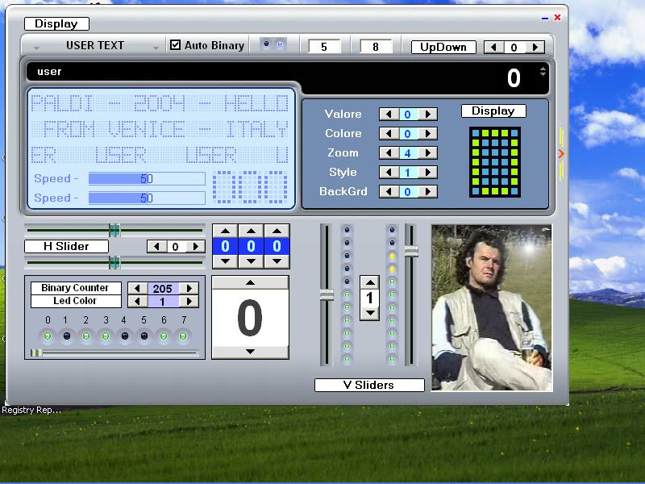



## DEMO OCX 21

### Description

ADDED NEW CONTROLS AND PATCHED OLDS ( See Readme )
 
### More Info
 

             |
---                |---
**Submitted On**   |2005-02-09 12:22:12
**By**             |[Bruno crepaldi](https://github.com/Planet-Source-Code/PSCIndex/blob/master/ByAuthor/bruno-crepaldi.md)
**Level**          |Intermediate
**User Rating**    |5.0 (25 globes from 5 users)
**Compatibility**  |VB 6\.0
**Category**       |[OLE/ COM/ DCOM/ Active\-X](https://github.com/Planet-Source-Code/PSCIndex/blob/master/ByCategory/ole-com-dcom-active-x__1-29.md)
**World**          |[Visual Basic](https://github.com/Planet-Source-Code/PSCIndex/blob/master/ByWorld/visual-basic.md)
**Archive File**   |[DEMO\_OCX\_21850982102005\.zip](https://github.com/Planet-Source-Code/bruno-crepaldi-demo-ocx-21__1-58824/archive/master.zip)

